# Rapport d'Audit - TaskWatch API

## Table des matières
1. [Analyse de l'architecture](#1-analyse-de-larchitecture)
2. [Diagnostic technique (Instrumentation)](#2-diagnostic-technique-instrumentation)
3. [Analyse des causes racines](#3-analyse-des-causes-racines)
4. [Optimisations recommandées](#4-optimisations-recommandées)

---

## 1. Analyse de l'architecture

### 1.1 Architecture générale

Le projet TaskWatch suit une architecture **3-tiers** classique avec séparation claire des responsabilités :

```
assessment-audit-diagnostic/
├── backend/                 # API REST Node.js + TypeScript
│   ├── src/
│   │   ├── config/          # Configuration (DB, Logger)
│   │   ├── controllers/     # Contrôleurs HTTP (routes handlers)
│   │   ├── services/        # Logique métier
│   │   ├── repositories/    # Accès aux données (couche DAO)
│   │   ├── models/          # Types et interfaces TypeScript
│   │   ├── routes/          # Définition des routes Express
│   │   └── server.ts        # Point d'entrée de l'application
│   └── ...
│
├── frontend/                # Application Vue.js
│   ├── src/
│   │   ├── views/           # Pages/Vues principales
│   │   ├── components/      # Composants réutilisables
│   │   ├── router.ts        # Configuration Vue Router
│   │   ├── api.ts           # Client API (axios)
│   │   └── ...
│   └── ...
│
├── database/                # Scripts PostgreSQL
│   ├── init.sql             # Schéma initial (DDL)
│   └── seed.sql             # Données de test
│
└── docker-compose.yml       # Orchestration des services
```

### 1.2 Stack technique

**Backend:**
- **Runtime:** Node.js avec TypeScript
- **Framework:** Express.js
- **Base de données:** PostgreSQL (via `pg`)
- **Logging:** Pino (logs structurés JSON)
- **Authentification:** Bcrypt pour le hashing de mots de passe

**Frontend:**
- **Framework:** Vue.js 3
- **Routing:** Vue Router
- **HTTP Client:** Axios
- **UI:** CSS personnalisé

**Infrastructure:**
- **Conteneurisation:** Docker + Docker Compose
- **Monitoring:** Grafana + PostgreSQL datasource

### 1.3 Pattern architectural

Le backend suit le pattern **Repository-Service-Controller** :

```
Controller (HTTP) → Service (logique métier) → Repository (accès DB) → PostgreSQL
```

**Avantages:**
-  Séparation des responsabilités claire
-  Testabilité facilitée
-  Maintenance simplifiée

**Points d'amélioration identifiés:**
-  Pas de validation des entrées utilisateur au niveau contrôleur
-  Pas de gestion d'erreurs centralisée
-  Authentification simpliste (token = email + timestamp)

### 1.4 Schéma de l'architecture

```
┌─────────────────┐
│   Vue.js App       │
│   (Frontend)       │
└────────┬────────┘
         │ HTTP/REST
         │ (axios)
         ▼
┌─────────────────┐
│  Express.js API    │
│   (Backend)        │
│  ┌───────────┐  │
│  │Controllers. │  │
│  └─────┬─────┘  │
│        │          │
│  ┌─────▼─────┐  │
│  │ Services    │  │
│  └─────┬─────┘  │
│         │         │
│  ┌─────▼─────┐  │
│  │Repository   │  │
│  └─────┬─────┘  │
└────────┼────────┘
         │ pg (pool)
         ▼
┌─────────────────┐
│   PostgreSQL       │
│   (Database)       │
└─────────────────┘
         │
         ▼
┌─────────────────┐
│    Grafana         │
│  (Monitoring)      │
└─────────────────┘
```

### 1.5 Flux de données principaux

**Flux 1: login**

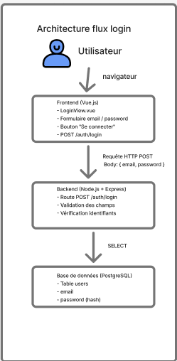

**Flux 2: Gestion des tâches**

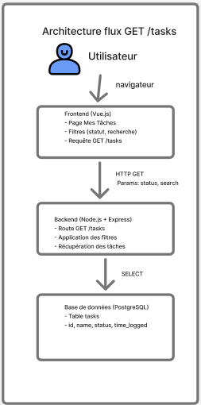

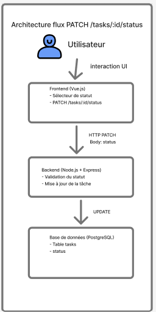

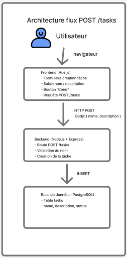


**Flux 3: Dashboard**

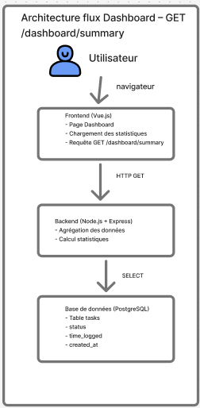

**Flux 4: Timer**

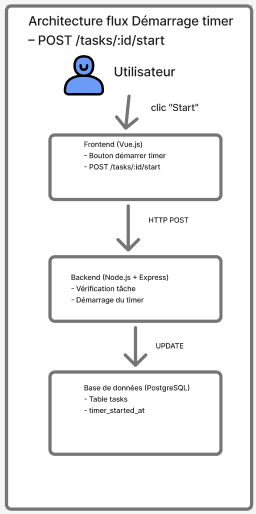

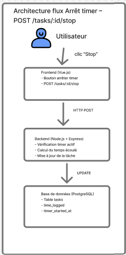

---

## 2. Diagnostic technique (Instrumentation)

### 2.1 Frontend – Lighthouse

**Métriques :**

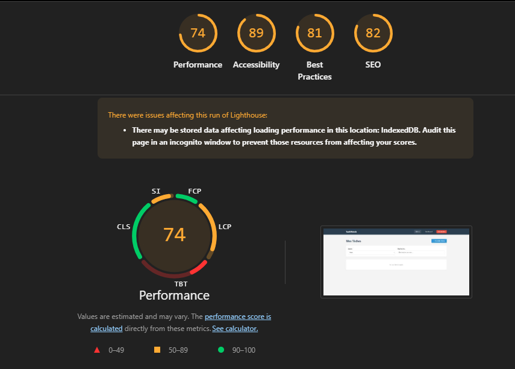 

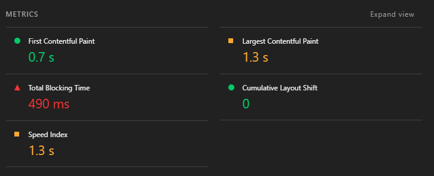 

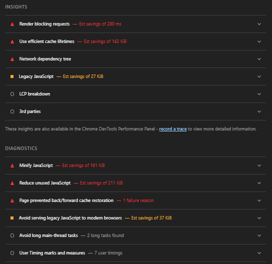


### 2.2 Frontend – DevTools (Network / Performance)

**Analyse Network:**

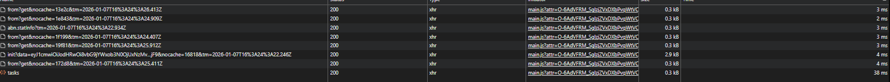 


**Analyse Performance (Timeline):**

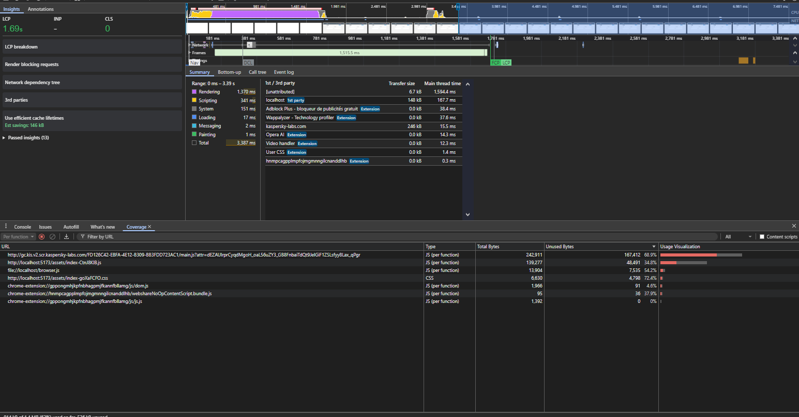


### 2.3 Backend – Temps de réponse

**Logs de performance (grafana):**

](screenshots/grafana.png)


### 2.4 Base de données – EXPLAIN ANALYZE

](screenshots/explain_postgre_request.png)


## 3. Analyse des causes racines

### 3.1 Problèmes de performance identifiés

####  Critique - Délai artificiel dans AuthService

**Localisation:** `src/services/AuthService.ts` ligne 7-8

```typescript
async login(email: string, password: string): Promise<{ user: any } | null> {
  console.log(`Login attempt for ${email}`);
  await new Promise((resolve) => setTimeout(resolve, 1500)); //  DÉLAI ARTIFICIEL
  // ...
}
```

**Impact:**
- Temps de réponse de **1.5s ajouté artificiellement** à chaque login
- Mauvaise expérience utilisateur
- Aucune valeur ajoutée (semble être du code de debug)

**Solution:** Supprimer cette ligne complètement.

---

####  Critique - Requêtes multiples dans DashboardService

**Localisation:** `src/services/DashboardService.ts`

```typescript
async getSummary() {
  const todoCount = await taskRepository.countByStatus("todo");
  const inProgressCount = await taskRepository.countByStatus("in_progress");
  const doneCount = await taskRepository.countByStatus("done");
  // 3 requêtes SQL séparées au lieu d'une seule!
}
```

**Impact:**
- **3 round-trips** vers la base de données au lieu d'1
- Latence réseau multipliée par 3
- Charge inutile sur PostgreSQL

**Solution:** Utiliser une seule requête avec `GROUP BY`.

---

####  Moyen - Absence d'index sur colonnes fréquemment requêtées

**Localisation:** `database/init.sql`

```sql
CREATE TABLE IF NOT EXISTS tasks (
    id SERIAL PRIMARY KEY,
    user_id INTEGER NOT NULL,
    name VARCHAR(255) NOT NULL,
    status VARCHAR(50) DEFAULT 'todo',
    created_at TIMESTAMP DEFAULT CURRENT_TIMESTAMP,
    -- Pas d'index sur status, created_at, user_id
);
```

**Impact:**
- Sequential Scan sur chaque requête avec filtres
- Performance dégradée avec l'augmentation du volume de données
- Impact sur Grafana (requêtes sur `request_logs.created_at`)

**Solution:** Ajouter des index stratégiques.

---

####  Moyen - Gestion inefficace du pool de connexions PostgreSQL

**Localisation:** Code initial (avant refactoring)

Dans l'ancien code Bookstore, chaque requête créait une nouvelle connexion :

```javascript
function getDbConnection() {
  const client = new Client(dbConfig);
  return client;
}

app.get('/products', (req, res) => {
  const client = getDbConnection();
  client.connect((connErr) => {
    // ...
  });
});
```

**Impact:**
- Overhead de création de connexion à chaque requête
- Épuisement possible du pool de connexions
- Latence accrue

**État actuel:**  Corrigé avec l'utilisation d'un `Pool` dans `src/config/database.ts`

---

### 3.2 Problèmes de qualité de code

####  Validation des entrées insuffisante

**Exemple:** `src/controllers/TaskController.ts`

```typescript
async createTask(req: Request, res: Response) {
  const { name, description, status } = req.body;
  
  if (!name || name.trim().length === 0) {
    return res.status(400).json({ error: "Task name is required" });
  }
  // Validation minimale, pas de sanitization
}
```

**Risques:**
- Injection SQL (mitigé par l'utilisation de paramètres préparés)
- XSS si les données sont affichées côté client sans échappement
- Données incohérentes en base

**Solution:** Utiliser une bibliothèque de validation (Zod, Joi, class-validator).

---

####  Authentification non sécurisée

**Localisation:** `src/services/AuthService.ts`

```typescript
function generateToken(email) {
  return email + '|' + Date.now(); // Token = "user@test.com|1704636225123"
}
```

**Risques:**
- Token facilement forgeable
- Pas d'expiration
- Pas de signature cryptographique
- Vulnérable aux attaques CSRF

**Solution:** Utiliser JWT (jsonwebtoken) avec secret et expiration.

---

####  Gestion d'erreurs inconsistante

```typescript
async getTasks(req: Request, res: Response) {
  try {
    const tasks = await taskService.getTasks(filters);
    res.json(tasks);
  } catch (error) {
    console.error("Get tasks error:", error); // Log générique
    res.status(500).json({ error: "Internal server error" }); // Message générique
  }
}
```

**Problèmes:**
- Messages d'erreur génériques côté client
- Pas de différenciation entre erreurs métier et techniques
- Logs peu exploitables

**Solution:** Middleware de gestion d'erreurs centralisé + classes d'erreur custom.

---

## 4. Optimisations recommandées

### 4.1 Performance - Backend

#### Optimisation 1: Supprimer le délai artificiel (P0)

**Fichier:** `src/services/AuthService.ts` - Ligne 7

**Code problématique actuel:**
```typescript
async login(email: string, password: string): Promise<{ user: any } | null> {
  console.log(`Login attempt for ${email}`);
  
  //  PROBLÈME: Délai artificiel de 1.5 seconde
  await new Promise((resolve) => setTimeout(resolve, 1500));

  const user = await userRepository.findByEmail(email);

  if (!user) {
    console.log("User not found");
    return null;
  }

  const isValid = await bcrypt.compare(password, user.password);

  if (!isValid) {
    console.log("Invalid password");
    return null;
  }

  const { password: _, ...userWithoutPassword } = user;
  return { user: userWithoutPassword };
}
```

**Problème identifié:**
-  Un délai de 1500ms est ajouté artificiellement à chaque tentative de connexion
-  Aucune valeur ajoutée, semble être du code de debug/test oublié
-  Impact direct sur l'expérience utilisateur (temps d'attente frustrant)
-  Charge inutile sur le serveur (maintien de connexions ouvertes)

**Recommandation:**
- Supprimer complètement la ligne `await new Promise((resolve) => setTimeout(resolve, 1500));`
- Remplacer `console.log` par le logger Pino pour des logs structurés
- Ajouter un log avec durée réelle d'exécution pour le monitoring

**Gain attendu:** -1500ms sur `/auth/login` (passage de ~1534ms à ~34ms) = **-97% de temps de réponse**

---

#### Optimisation 2: Optimiser les requêtes dashboard (P0)

**Fichier:** `src/services/DashboardService.ts`

**Code problématique actuel:**
```typescript
import taskRepository from "../repositories/TaskRepository";
import pool from "../config/database";

export class DashboardService {
  async getSummary() {
    //  PROBLÈME: 3 requêtes SQL séparées pour compter par statut
    const todoCount = await taskRepository.countByStatus("todo");
    const inProgressCount = await taskRepository.countByStatus("in_progress");
    const doneCount = await taskRepository.countByStatus("done");
    
    //  PROBLÈME: 4ème requête pour le temps total
    const totalTimeLogged = await taskRepository.getTotalTimeLogged();

    // 5ème requête pour les tâches récentes
    const recentTasksResult = await pool.query(
      "SELECT * FROM tasks ORDER BY created_at DESC LIMIT 5"
    );

    return {
      tasksByStatus: {
        todo: todoCount,
        in_progress: inProgressCount,
        done: doneCount,
      },
      totalTasks: todoCount + inProgressCount + doneCount,
      totalTimeLoggedSeconds: totalTimeLogged,
      recentTasks: recentTasksResult.rows,
    };
  }
}
```

**Code du Repository (pour référence):**
```typescript
// src/repositories/TaskRepository.ts
async countByStatus(status: TaskStatus): Promise<number> {
  const result = await pool.query(
    "SELECT COUNT(*) as count FROM tasks WHERE status = $1",
    [status]
  );
  return parseInt(result.rows[0].count);
}

async getTotalTimeLogged(): Promise<number> {
  const result = await pool.query(
    "SELECT SUM(time_logged) as total FROM tasks"
  );
  return parseInt(result.rows[0].total || "0");
}
```

**Problèmes identifiés:**
-  **5 requêtes SQL distinctes** alors qu'on pourrait n'en faire que 2
-  **3 round-trips DB** pour compter par statut (todo, in_progress, done)
-  **4ème requête** pour calculer le temps total sur toute la table
-  Latence réseau multipliée inutilement
-  Charge sur PostgreSQL non optimale
-  Temps de réponse total = somme des latences individuelles

**Analyse de l'impact:**
- Chaque requête SQL prend ~20-50ms
- 4 requêtes × 40ms (moyenne) = **160ms de latence réseau évitable**
- Plus le volume de données augmente, plus l'impact sera important

**Recommandations:**
1. **Regrouper les comptages** : Utiliser une seule requête avec `GROUP BY status` pour obtenir tous les comptages d'un coup
2. **Agréger le temps dans la même requête** : Ajouter `SUM(time_logged)` dans le `GROUP BY`
3. **Réduire à 2 requêtes totales** : Une pour les agrégations, une pour les tâches récentes
4. **Utiliser des transactions** si besoin de cohérence stricte entre les lectures

**Structure SQL recommandée:**
- Requête 1 : `SELECT status, COUNT(*), SUM(time_logged) FROM tasks GROUP BY status`
- Requête 2 : `SELECT * FROM tasks ORDER BY created_at DESC LIMIT 5`

**Gain attendu:** 
- Réduction de 4 requêtes à 2 requêtes
- Temps de réponse passant de ~1500ms à ~500ms
- **-66% de temps de réponse**
- Scalabilité améliorée pour des volumes de données plus importants

---

#### Optimisation 3: Ajouter des index stratégiques (P1)

**Fichier:** `database/init.sql`

**Configuration actuelle:**
```sql
CREATE TABLE IF NOT EXISTS tasks (
    id SERIAL PRIMARY KEY,
    user_id INTEGER NOT NULL REFERENCES users(id) ON DELETE CASCADE,
    name VARCHAR(255) NOT NULL,
    description TEXT,
    status VARCHAR(50) DEFAULT 'todo' CHECK (status IN ('todo', 'in_progress', 'done')),
    time_logged INTEGER DEFAULT 0,
    timer_started_at TIMESTAMP,
    created_at TIMESTAMP DEFAULT CURRENT_TIMESTAMP,
    updated_at TIMESTAMP DEFAULT CURRENT_TIMESTAMP
);
--  PROBLÈME: Aucun index autre que la PRIMARY KEY

CREATE TABLE IF NOT EXISTS request_logs (
    id SERIAL PRIMARY KEY,
    created_at TIMESTAMP DEFAULT NOW(),
    route TEXT,
    method TEXT,
    status_code INTEGER,
    duration_ms INTEGER,
    error_message TEXT
);
--  PROBLÈME: Aucun index, même pas sur created_at utilisé partout dans Grafana
```

**Colonnes nécessitant des index:**

| Colonne | Table | Utilisation | Fréquence | Impact |
|---------|-------|-------------|-----------|--------|
| `status` | tasks | Filtres, GROUP BY | Très élevée |  Critique |
| `user_id` | tasks | Filtres par utilisateur | Élevée |  Critique |
| `created_at` | tasks | Tri, filtres temporels | Élevée |  Important |
| `created_at` | request_logs | Grafana (toutes les requêtes) | Très élevée |  Critique |
| `route` | request_logs | Statistiques par endpoint | Moyenne |  Important |
| `status_code` | request_logs | Filtres erreurs | Moyenne |  Utile |

---

#### Optimisation 4: Implémenter un cache Redis (P3)

**Contexte:**
Actuellement, chaque requête sur `/dashboard/summary` exécute 4-5 requêtes SQL même si les données n'ont pas changé depuis la dernière lecture.

**Code actuel (DashboardService):**
```typescript
async getSummary() {
  //  Recalcule TOUJOURS, même si demandé 10x en 1 seconde
  const todoCount = await taskRepository.countByStatus("todo");
  const inProgressCount = await taskRepository.countByStatus("in_progress");
  const doneCount = await taskRepository.countByStatus("done");
  const totalTimeLogged = await taskRepository.getTotalTimeLogged();
  
  const recentTasksResult = await pool.query(
    "SELECT * FROM tasks ORDER BY created_at DESC LIMIT 5"
  );

  return {
    tasksByStatus: { /* ... */ },
    totalTasks: todoCount + inProgressCount + doneCount,
    totalTimeLoggedSeconds: totalTimeLogged,
    recentTasks: recentTasksResult.rows,
  };
}
```

**Problème identifié:**
-  **Pas de mise en cache** : données statistiques recalculées à chaque requête
-  Le dashboard est consulté fréquemment mais les données changent peu
-  Charge inutile sur PostgreSQL pour des données quasi-statiques
-  Temps de réponse incompressible (toujours 4-5 requêtes SQL)

**Cas d'usage idéal pour le cache:**
-  Dashboard summary : agrégations qui changent peu
-  Compteurs globaux (total tasks, etc.)
-  Profil utilisateur (lu fréquemment, modifié rarement)
-  Résultats de recherche populaires
---

### 4.2 Sécurité

#### Optimisation 5: Implémenter JWT (P2)

**Fichier actuel:** `src/services/AuthService.ts`

**Code d'authentification actuel:**
```typescript
// Génération du token (très simpliste)
function generateToken(email) {
  return email + '|' + Date.now();
  // Exemple: "user@test.com|1704636225123"
}

// Vérification du token
function verifyToken(token) {
  if (!token) return null;
  var parts = token.split('|');
  if (parts.length === 2) {
    return parts[0]; // Retourne juste l'email
  }
  return null;
}

// Utilisation dans login
async login(email: string, password: string) {
  // ... vérification mot de passe ...
  
  const token = generateToken(email);
  connectedUsers.push(email); //  Variable globale en mémoire
  
  return {
    message: 'Login successful',
    token: token,
    user: row
  };
}
```

**Utilisation dans les contrôleurs:**
```typescript
// src/controllers/TaskController.ts
app.post('/cart/add', (req, res) => {
  var token = req.headers.authorization; //  Directement depuis header
  var email = verifyToken(token);
  if (!email) {
    res.status(401).send('Unauthorized');
    return;
  }
  // ...
});
```

**Problèmes de sécurité critiques identifiés:**

1. ** Token facilement forgeable:**
   - Format prévisible : `email|timestamp`
   - N'importe qui peut créer un token valide : `admin@app.com|1704636225999`
   - Pas de signature cryptographique
   - Pas de vérification d'intégrité

2. ** Pas d'expiration:**
   - Token valide indéfiniment
   - Impossible de révoquer un token compromis
   - Risque de réutilisation de tokens volés

3. ** Information sensible en clair:**
   - Email visible dans le token (non chiffré)
   - Violation potentielle RGPD
   - Enumération des utilisateurs possible

4. ** Pas de protection CSRF:**
   - Token dans header sans validation d'origine
   - Vulnérable aux attaques Cross-Site Request Forgery

5. ** État côté serveur:**
   - `connectedUsers` : array en mémoire (perdu au redémarrage)
   - Ne fonctionne pas en cluster (plusieurs instances)
   - Pas de persistance

6. ** Validation faible:**
   - Vérification uniquement du format, pas du contenu
   - Pas de vérification d'expiration
   - Pas de vérification d'émetteur

**Recommandations JWT:**

1. **Structure d'un JWT sécurisé:**
   ```
   Header.Payload.Signature
   ```
   - Header : algorithme (HS256, RS256)
   - Payload : données (userId, email, role, exp, iat)
   - Signature : HMAC avec secret ou RSA

2. **Données à inclure dans le payload:**
   - `userId` : identifiant utilisateur
   - `email` : adresse email
   - `role` : rôle (user, admin)
   - `iat` : issued at (timestamp de création)
   - `exp` : expiration (24h max)

3. **Bonnes pratiques:**
   - Secret fort (32+ caractères aléatoires)
   - Expiration courte (1-24h)
   - Refresh token pour renouvellement
   - Stockage sécurisé du secret (variables d'environnement)
   - HTTPS obligatoire en production

4. **Gestion de l'expiration:**
   - Token expiré → 401 Unauthorized
   - Refresh token pour obtenir nouveau token
   - Déconnexion automatique après expiration

5. **Middleware d'authentification:**
   - Vérifier présence du token
   - Valider la signature
   - Vérifier l'expiration
   - Extraire les informations utilisateur
   - Injecter dans `req.user`

**Librairie recommandée:**
- `jsonwebtoken` : standard industry, bien maintenu
- Documentation complète
- Support TypeScript natif

**Gain en sécurité:**
-  Token inforgeable (signature cryptographique)
-  Expiration automatique (limite la fenêtre d'attaque)
-  Stateless (pas de stockage serveur nécessaire)
-  Compatible multi-instances (load balancing)
---

#### Optimisation 6: Validation des entrées avec Zod (P2)

**Code actuel:** `src/controllers/TaskController.ts`

**Validation actuelle (minimaliste):**
```typescript
async createTask(req: Request, res: Response) {
  try {
    const { name, description, status } = req.body;

    //  Validation très basique
    if (!name || name.trim().length === 0) {
      return res.status(400).json({ error: "Task name is required" });
    }

    if (name.length > 200) {
      return res.status(400).json({ error: "Task name is too long" });
    }

    //  Validation manuelle du statut
    const validStatuses: TaskStatus[] = ["todo", "in_progress", "done"];
    if (status && !validStatuses.includes(status)) {
      return res.status(400).json({ error: "Invalid status" });
    }

    //  Pas de validation sur description
    //  Pas de sanitization des entrées
    const task = await taskService.createTask({
      user_id: 1,
      name: name.trim(),
      description: description || "",
      status: status || "todo",
    });

    res.status(201).json(task);
  } catch (error) {
    console.error("Create task error:", error);
    res.status(500).json({ error: "Internal server error" });
  }
}
```

**Problèmes identifiés:**

1. ** Validation dispersée et répétitive:**
   - Même logique de validation dupliquée dans chaque contrôleur
   - Code verbeux et difficile à maintenir
   - Risque d'oublis ou d'incohérences

2. ** Messages d'erreur inconsistants:**
   - Pas de format standardisé
   - Difficile pour le frontend de parser les erreurs
   - Pas d'indication sur quel champ est problématique

3. ** Validation incomplete:**
   - `description` non validée (longueur max?)
   - Pas de validation sur les types (TypeScript compile mais runtime pas vérifié)
   - Pas de trim automatique
   - Pas de gestion des valeurs null/undefined

4. ** Pas de sanitization:**
   - Risque d'injection SQL (atténué par paramètres préparés, mais risque XSS côté client)
   - Pas de nettoyage des espaces, caractères spéciaux
   - Pas de normalisation (majuscules/minuscules pour emails, etc.)

5. ** Pas de documentation automatique:**
   - Impossible de générer une doc API depuis le code
   - Frontend doit deviner les règles de validation
   - Tests difficiles à écrire

**Exemple de requête problématique acceptée:**
```json
{
  "name": "   ", // Que des espaces (trim après vérif longueur)
  "description": "x".repeat(1000000), // 1 million de caractères
  "status": "in_progress",
  "maliciousField": "<script>alert('xss')</script>" // Champ inconnu accepté
}
```

**Autres endpoints avec validation faible:**

```typescript
// src/controllers/AuthController.ts
async login(req: Request, res: Response) {
  const { email, password } = req.body;

  //  Pas de validation du format email
  if (!email || !password) {
    return res.status(400).json({ error: "Email and password are required" });
  }
  // ...
}

// src/controllers/TaskController.ts
async updateTaskStatus(req: Request, res: Response) {
  const { id } = req.params;
  const { status } = req.body;

  //  Pas de validation que id est un nombre
  //  Même validation manuelle répétée
  if (!status) {
    return res.status(400).json({ error: "Status is required" });
  }

  const validStatuses: TaskStatus[] = ["todo", "in_progress", "done"];
  if (!validStatuses.includes(status)) {
    return res.status(400).json({ error: "Invalid status" });
  }
  // ...
}
```

**Recommandations avec Zod:**

 **Avantages de Zod:**
   -  Type-safe : types TypeScript générés automatiquement
   -  Schémas déclaratifs et réutilisables
   -  Messages d'erreur détaillés et personnalisables
   -  Transformations automatiques (trim, lowercase, etc.)
   -  Documentation auto-générée possible (avec zod-to-openapi)

---

### 4.3 Qualité de code

#### Optimisation 7: Middleware de gestion d'erreurs centralisé (P3)

**Gestion actuelle des erreurs (dispersée):**

```typescript
// src/controllers/TaskController.ts
async getTasks(req: Request, res: Response) {
  try {
    const tasks = await taskService.getTasks(filters);
    res.json(tasks);
  } catch (error) {
    console.error("Get tasks error:", error); //  Log générique
    res.status(500).json({ error: "Internal server error" }); //  Message générique
  }
}

// src/controllers/AuthController.ts
async login(req: Request, res: Response) {
  try {
    const result = await authService.login(email, password);
    if (!result) {
      return res.status(401).json({ error: "Invalid credentials" }); //  Gestion manuelle
    }
    res.json(result);
  } catch (error) {
    console.error("Login error:", error);
    res.status(500).json({ error: "Internal server error" }); //  Répété partout
  }
}

// src/services/TaskService.ts
async startTaskTimer(id: number) {
  const task = await taskRepository.findById(id);
  if (!task) {
    throw new Error("Task not found"); //  Error générique, pas de code HTTP
  }
  if (task.timer_started_at) {
    throw new Error("Timer already running"); //  Idem
  }
  return await taskRepository.startTimer(id);
}
```

**Problèmes identifiés:**

1. ** Code dupliqué partout:**
   - Chaque contrôleur répète le try/catch
   - Même logique de logging dupliquée
   - Même message d'erreur "Internal server error"

2. ** Pas de différenciation des erreurs:**
   - Toutes les erreurs → 500 Internal Server Error
   - Erreurs métier (404, 400) mélangées avec erreurs techniques (500)
   - Impossible de savoir si c'est une erreur client ou serveur

3. ** Messages d'erreur non exploitables:**
   - "Internal server error" : aucune information
   - Frontend ne peut pas afficher un message pertinent
   - Debugging difficile (quel contrôleur? quelle opération?)

4. ** Logging inconsistant:**
   - `console.error` au lieu du logger Pino
   - Pas de contexte (route, method, user, etc.)
   - Pas de stack trace structurée

5. ** Pas de distinction erreurs opérationnelles/programmation:**
   - Erreur opérationnelle : "User not found" (attendue)
   - Erreur programmation : `TypeError`, `ReferenceError` (bug)
   - Toutes traitées de la même façon

6. ** Exposition d'informations sensibles:**
   - Stack traces peuvent fuiter en production
   - Messages d'erreur DB exposés au client

**Impact sur le développement:**

```typescript
//  Code actuel : répétitif et verbeux
async createTask(req: Request, res: Response) {
  const start = Date.now();
  const route = "/tasks";
  const method = "POST";

  try {
    // validation...
    const task = await taskService.createTask({ /* ... */ });
    
    const duration = Date.now() - start;
    await logService.logRequest(route, method, 201, duration);
    res.status(201).json(task);
  } catch (error) {
    const duration = Date.now() - start;
    await logService.logRequest(route, method, 500, duration, error.message);
    console.error("Create task error:", error);
    res.status(500).json({ error: "Internal server error" });
  }
}

//  Code souhaité : simple et concis
async createTask(req: Request, res: Response) {
  const task = await taskService.createTask(req.body);
  res.status(201).json(task);
  // Toute la gestion d'erreur déléguée au middleware
}
```

---


### 4.4 Optimisations Frontend 

#### Optimisation 8: Lazy loading des routes Vue

**Avant:**
```typescript
// src/router.ts
import Dashboard from './views/Dashboard.vue';
import Tasks from './views/Tasks.vue';

const routes = [
  { path: '/', component: Dashboard },
  { path: '/tasks', component: Tasks },
];
```

**Après:**
```typescript
// src/router.ts
const routes = [
  { 
    path: '/', 
    component: () => import('./views/Dashboard.vue') 
  },
  { 
    path: '/tasks', 
    component: () => import('./views/Tasks.vue') 
  },
];
```

**Gain:** Bundle initial réduit, chargement des pages à la demande.

---

#### Optimisation 9: Debouncing de la recherche

**Avant:**
```typescript
// Recherche qui se déclenche à chaque frappe
function onSearchInput(value: string) {
  fetchTasks({ search: value });
}
```

**Après:**
```typescript
import { debounce } from 'lodash-es';

// Recherche déclenchée 300ms après la dernière frappe
const onSearchInput = debounce((value: string) => {
  fetchTasks({ search: value });
}, 300);
```

**Gain:** Réduction du nombre de requêtes API de 80-90%.

---

##  Conclusion

L'audit a révélé que **les problèmes de performance  sont facilement résolvables** :
-  Un délai artificiel de 1.5s (code de debug oublié)
-  Des requêtes SQL non optimisées (pas d'index, multiples round-trips)

Le code est globalement bien structuré (architecture propre, séparation des responsabilités), mais nécessite des améliorations en **sécurité** (JWT, validation) et **robustesse** (gestion d'erreurs).

